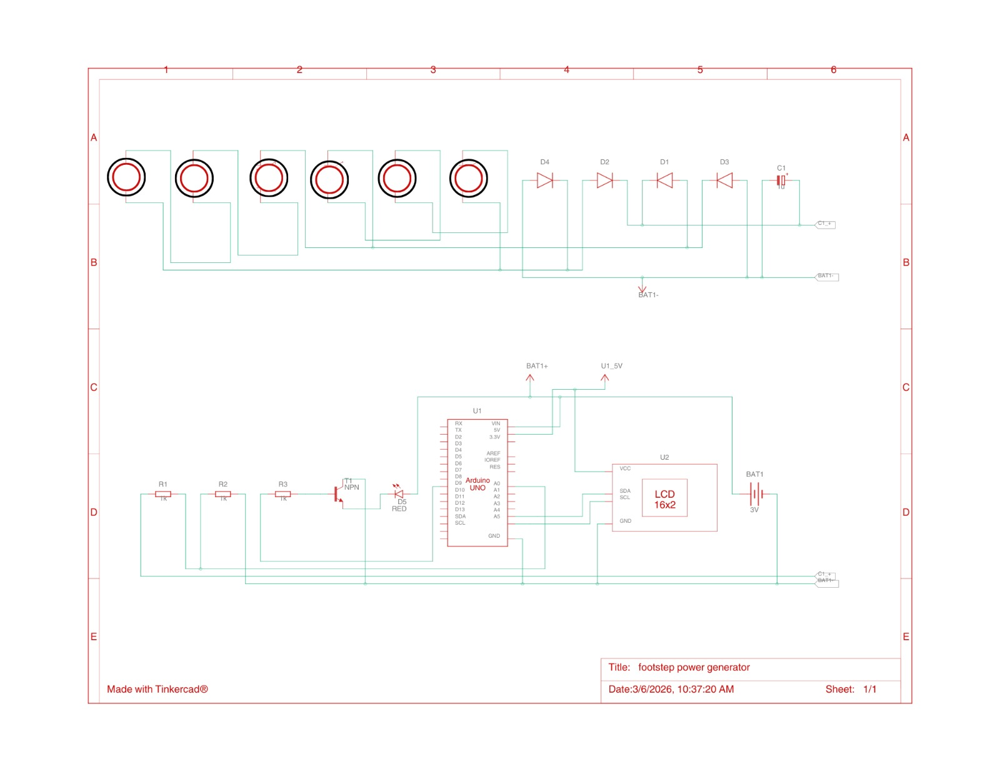
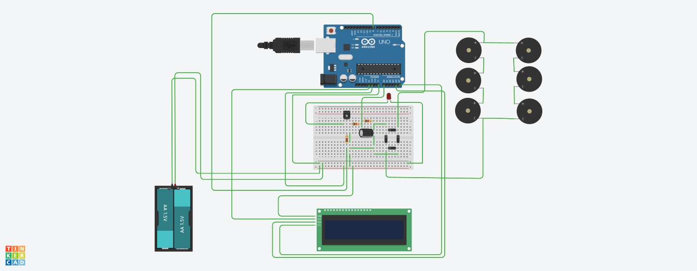
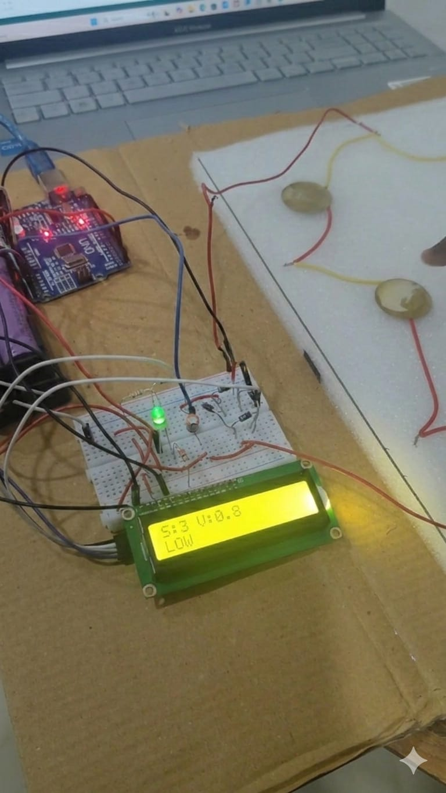

  

# [FOOTSTEP POWER GENERATOR] 🎯

## Basic Details

### Team Name: [Dual Core]

### Team Members
- Member 1: [Anaan Shaji] - [College Of Engineering Perumon]
- Member 2: [Alphy Aby] - [College Of Engineering Perumon]

### Project Description
[This project develops a smart piezoelectric tile that converts footsteps into electrical energy. The generated voltage is measured using an Arduino to detect steps, estimate energy production, and monitor crowd levels. The system displays real-time data such as step count and peak voltage on an LCD, demonstrating a simple approach to energy harvesting in public spaces.]

### The Problem statement
[In crowded public places such as railway stations, malls, and college campuses, thousands of footsteps generate mechanical energy every day. This energy is normally wasted.]

### The Solution
[The solution uses piezoelectric sensors embedded in a tile to generate voltage from human footsteps. An Arduino reads the voltage signal to detect steps and measure the peak voltage produced. The system displays the step count and voltage values on an LCD screen, providing a simple method for monitoring foot traffic and generated voltage in real time.]

---

## Technical Details

### Technologies/Components Used

**For Hardware:**
- Main components: [35mm Piezo discs ,Arduino UNO,LCD I2C display,18650 cell,resistor , capacitor, diodes]
- Specifications: [35mm Piezo Disc-Generates voltage spikes when pressure is applied.
   Arduino UNO-Reads sensor input and controls display.16×2 I2C LCD Display-Shows step count and voltage in real time.]
- Tools required: [Mini Breadboard,Hookup wires,Jumper wires,Arduino IDE, LCD Library, Soldering Iron]

---

## Features

List the key features of your project:
- Feature 1: [Detects footsteps using piezoelectric sensors.]
- Feature 2: [Measures and displays the maximum voltage generated so far.]
- Feature 3: [Counts steps and shows the total on an LCD display.]
- Feature 4: [Works as a simple demonstration of energy harvesting from footsteps.]

---

## Implementation

### For Hardware:

#### Components Required
[35mm Piezo Disc

Generates voltage spikes when pressure is applied.

Arduino UNO

Reads sensor input and controls display.

16×2 I2C LCD Display

Shows step count and voltage in real time.

1N4007 Diode

Converts AC from piezo to DC.

10µF Capacitor

Stores the rectified voltage temporarily.

18650 Battery

Provides portable 3.7V power supply.

I2C LCD Pins

SDA → A4, SCL → A5, VCC → 5V, GND → GND.
]

#### Circuit Setup
[1. Connect the six piezoelectric discs in series so that their voltage adds up when pressure is applied.

2. The output from the piezo discs is connected to a bridge rectifier made using four diodes to convert the AC signal from the discs into DC.

3. The rectified output is passed through a capacitor to smooth and store the generated voltage.

4. This stored voltage is connected to the battery terminals to store the energy.

5. The battery powers the Arduino Uno, which processes the voltage signal.

6. An LCD (16×2) is connected to the Arduino using SDA and SCL pins to display the generated power information.

7. A transistor and resistors are used to drive an LED indicator, which lights up when power is generated.
]

---

## Project Documentation

### For Hardware:

#### Schematic & Circuit

*Footstep pressure on piezo sensors generates voltage. The voltage is rectified using diodes and filtered by a capacitor, then supplied to the Arduino Uno. The system detects the signal and shows the output on a 16×2 LCD display.*

*The schematic shows the connection of piezo sensors, rectifier diodes, capacitor, resistors, transistor, and the Arduino Uno. These components work together to detect footsteps and display the result on the 16×2 LCD module.*

#### Build Photos

*List out all components shown*

*Explain the final build*

---

## Additional Documentation

### For Hardware Projects:

#### Bill of Materials (BOM)

| Component | Quantity | Specifications | Price | Link/Source |
|-----------|----------|----------------|-------|-------------|
| Arduino Uno | 1 | ATmega328P, 16MHz | ₹260 | [Link] |
| LED | 1| green, 5mm, 20mA | ₹2 each | [Link] |
| Resistor | 3 | 100kΩ,10kΩ, 330Ω | ₹1 each | [Link] |
| Mini Breadboard | 1 | 400 points | ₹50 | [Link] |
| Jumper Wires | 30 | Male-to-Male, Male to female | ₹2 each | [Link] |
| Piezoelectric Disc | 6|  35mm      |₹15 each| |
|capacitor|1| 10uf|₹2.5||
|LCD Display|1|16*2 I2C|₹175|

**Total Estimated Cost:** ₹[850]

#### Assembly Instructions

**Step 1: Prepare Components**
1. Gather all components listed in the BOM
2. Check component specifications
3. Prepare your workspace
   
**Step 2: Build the Power Supply**
1. Connect the power rails on the breadboard
2. Connect Arduino 5V to breadboard positive rail
3. Connect Arduino GND to breadboard negative rail

**Step 3: Connect the piezoelectric discs**
1. Connect the piezo discs in series so the voltage produced by each disc adds together.
2. Connect the output wires from the discs to the rectifier circuit.

**Step 4: Rectify and Smooth the Voltage**
1. Connect four diodes in a bridge rectifier configuration to convert the AC output from the piezo discs into DC.
2. Add a capacitor across the output to smooth the voltage.

**Step 5: Connect Arduino and Output Components**
1. Connect the circuit output to the Arduino input pins.
2. Add the transistor, resistors, and LED as an indicator.

**Step 6: Connect the LCD Display**
1. Connect the 16×2 LCD module to Arduino using SDA and SCL pins and power it from the rails.

**Step 7: Test the Circuit**
1. Apply pressure on the piezo discs (footsteps).
2.Observe the LED and LCD to verify that power is generated and detected.

**Final Assembly:**

*Caption: Completed project ready for testing*

---

## Project Demo

### Video
[Add your demo video link here - YouTube, Google Drive, etc.]

*Explain what the video demonstrates - key features, user flow, technical highlights*

---

## AI Tools Used (Optional - For Transparency Bonus)

If you used AI tools during development, document them here for transparency:

**Tool Used:** [ChatGPT]

**Purpose:** [What you used it for]
-  AI helped us find the most efficient way to connect and use our components
-  For circuit Debugging assistance 
-  Code review and optimization suggestions
-  Understanding piezoelectric working principle
-  Drafting presentation scripts

**Key Prompts Used:**
- "Check if this circuit setup will correctly charge the capacitor from the piezo discs.”
- "Suggest ways to reduce energy loss in the connections and diodes"
- "Modify Arduino code to display actual voltage instead of analog value."
- "How to measure real-time voltage from piezo using Arduino?"
  
**Percentage of AI-generated code:** [Approximately 30%]

**Human Contributions:**
Designed the system architecture and circuit layout
Assembled and wired the hardware components
Developed and modified the Arduino code
Integrated hardware and software components
Tested, debugged, and calibrated the system

## Team Contributions

- [Anaan Shaji]: [Contributed to system architecture planning, assembled and wired the hardware components including the piezo sensor and voltage divider, Implemented Arduino code, supported system integration, and participated in testing, debugging, documentation, and presentation.]
- [Alphy Aby]: [Contributed to system architecture planning, developed and modified the Arduino code, integrated the LCD display and transistor circuit, assisted in hardware assembly and wiring, and participated in system integration, testing, debugging, documentation, and presentation.]

Made with ❤️ at TinkerHub
